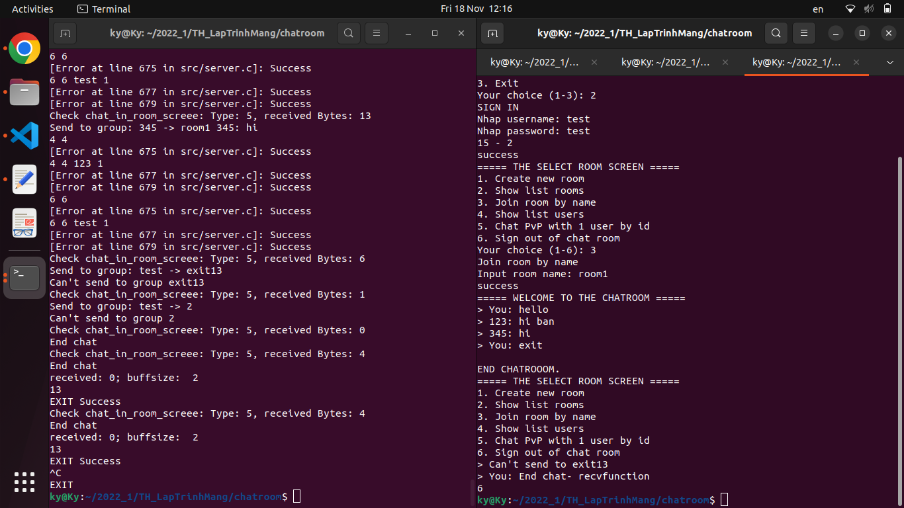
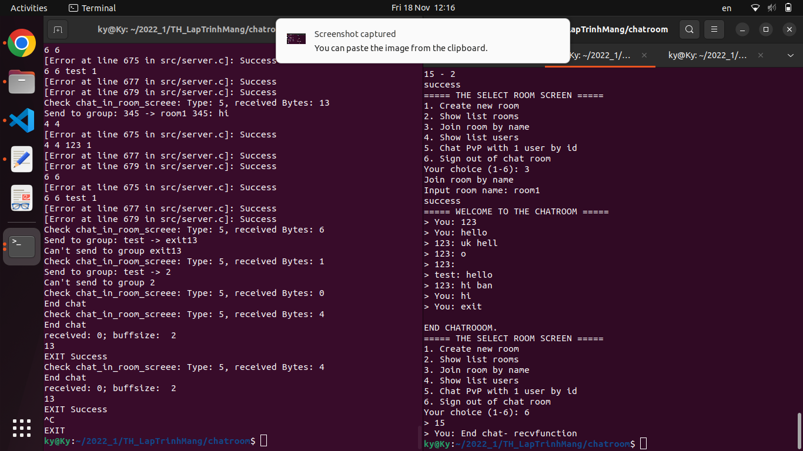

auth account:

signin username password

signup username password

sigout username

## Lưu trữ trong chương trình đang chạy
JRB Tree clients node (Lưu các user đang online)
key: when thread connect to server auto set id
value: struct Client

JRB Tree accounts node (Lưu tất cả các account)
key: username
value: struct Account

JRB Tree rooms (Lưu tất cả các rooms)
key:
value: 

Account *acc = (Account *) malloc(sizeof(Account));

jrb_insert_str(accounts, acc->username, new_jval_v(acc));

Account * findedAcc = (Account *) jval_v(node->val);

<!-- BUG -->
## BUG:
0. yêu cầu chọn menu là int nhưng nhập vào string treo luôn 

1. Client sau khi thoát chat bị in thừa dòng (lỗi có thể do chưa tắt thread nhiệm vụ ghi - chưa tìm ra giải pháp mới để khắc phục)
- Tần suất xuất hiện: lúc có lúc không (ko thể kiểm soát)

2. Đang chat (PVP - chat in ROOM chưa thử) // Đã FIX
- thoát bằng cách Ctrl + C -> server core dump luôn (Chưa nghĩ ra tình huống sửa)
- Tuy nhiên thoát bằng cách gõ 'exit' vẫn thoát bình thường

3. Chat gửi nhiều bị ngắt thành 2 lần chat (Chưa nghĩ ra lý do và hướng fix) // Đã FIX
- Do tách nhiệm vụ đọc input từ bàn phím vào thành function prompt_input_ver2 
- Nhưng hàm bị tự lặp câu lệnh printf 1 cách khó hiểu (hoặc lặp cả hàm) - khó hiểu
-> giải quyết bằng cách viết trực tiếp không gọi hàm ngoài 
<!-- BUG -->

<!-- GHi chú -->

## Protocol:
- Trong phần 2 chức năng của báo cáo

[Link báo cáo - Quyền Edit](https://docs.google.com/presentation/d/1OZ27YXRjhlMyz_se05yAO7Ovmwzghj3y/edit?usp=sharing&ouid=107276978507869957770&rtpof=true&sd=true)

### accounts.txt format

username password id_user

### rooms.txt format

roomName ownerName id_owner num_guest

id_owner

id_guest1

id_getst2

...

## Các hướng phát triển tiếp:
`#` Gửi file

`#` Lưu trữ các đoạn chat của PVP - Hiển thị lên màn hình